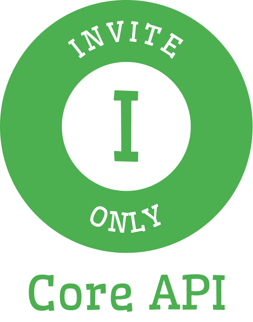
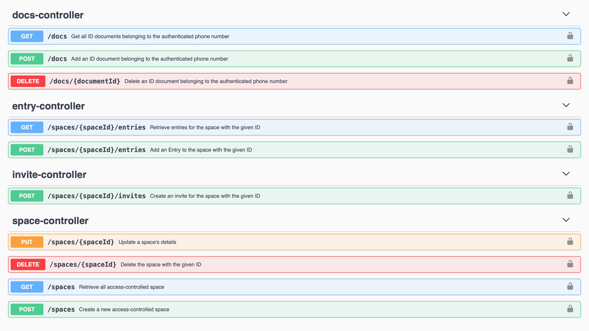

<!-- PROJECT LOGO -->
<p align="right">
<a href="https://www.up.ac.za">

</a>
</p>
<p align="center">

</p>

<!-- PROJECT SHIELDS -->
<p align="center">
<a href="https://github.com/marcus-bornman/cos_700_project/actions?query=workflow%3Abuild"></a>
<a href="https://github.com/marcus-bornman/cos_700_project/issues"></a>
<a href="https://github.com/marcus-bornman/cos_700_project/network"></a>
<a href="https://github.com/marcus-bornman/cos_700_project/stargazers"></a>
<a href="https://google.github.io/styleguide/javaguide.html"></a>
<a href="https://github.com/marcus-bornman/cos_700_project/blob/master/LICENSE"></a>
</p>

---

<!-- TABLE OF CONTENTS -->
## Table of Contents
* [About the Project](#about-the-project)
* [Getting Started](#getting-started)
* [Usage](#usage)
* [Roadmap](#roadmap)
* [Contributing](#contributing)
* [License](#license)
* [Contact](#contact)
* [Acknowledgements](#acknowledgements)


<!-- ABOUT THE PROJECT -->
## About The Project
<p align="center">

</p>

This assignment - completed as part of the COS790 (Hyper-Heuristics) Honours module at the University of Pretoria -
involves implementing a generation constructive hyper-heuristic to create heuristics for the symmetric and asymmetric 
travelling salesman problem.

See the following for detailed information about the project:
* [specification.pdf](assets/specification.pdf) - The specification for this assignment.
* [report.pdf](assets/report/report.pdf) - The report submitted for this assignment.

### Built With
* [Java](https://www.java.com/en/)
* [Apache Maven](https://maven.apache.org)


<!-- GETTING STARTED -->
## Getting Started
To build this project you will need to have Java 13 and [Apache Maven](https://maven.apache.org) installed.

You can ensure that the project compiles by running the following command in the root folder of this project:
```
mvn clean compile assembly:single
```


<!-- USAGE EXAMPLES -->
## Usage
To reproduce the results mentioned in [the report for this assignment](assets/report/report.pdf), you simply need to run the
[reproduce.sh](results/reproduce.sh) script from the root folder of this project:
```shell script
sh results/reproduce.sh
```
This will reproduce the output for 10 test runs for each of the tested problems in [problems folder](src/main/resources/problems) in the [results folder](results).


<!-- ROADMAP -->
## Roadmap
See the [open issues](https://github.com/marcus-bornman/cos_700_project/issues) for a list of other proposed features (and known issues).


<!-- CONTRIBUTING -->
## Contributing

Contributions are what make the open source community such an amazing place to be learn, inspire, and create. Any contributions you make are **greatly appreciated**.

1. Fork the Project
2. Create your Feature Branch (`git checkout -b feature/AmazingFeature`)
3. Commit your Changes (`git commit -m 'Add some AmazingFeature'`)
4. Push to the Branch (`git push origin feature/AmazingFeature`)
5. Open a Pull Request


<!-- LICENSE -->
## License

Distributed under the Academic Free License. See [LICENSE](LICENSE) for more information.


<!-- CONTACT -->
## Contact

Marcus Bornman - [marcusbornman.com](https://www.marcusbornman.com) - [marcus.bornman@gmail.com](mailto:marcus.bornman@gmail.com)

Project Link: [https://github.com/marcus-bornman/cos_700_project](https://github.com/marcus-bornman/cos_700_project)


<!-- ACKNOWLEDGEMENTS -->
## Acknowledgements
* [TSPLIB4J](https://github.com/dhadka/TSPLIB4J)
* [EvoHyp](https://sites.google.com/view/evohyp)
* [Shields IO](https://shields.io)
* [Open Source Licenses](https://choosealicense.com)